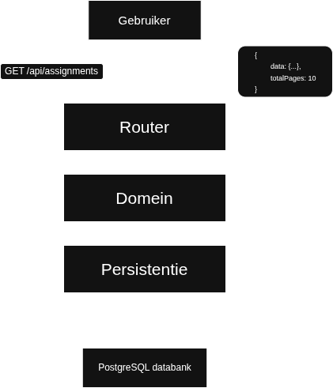

# Informatie backend server.

In deze readme.md kunt u informatie vinden over de structuur en werking van de backend server.

## Architectuur

We kozen ervoor om in de backend te werken met een 3-lagenarchitectuur. Deze bestaat uit de route-laag, domeinlaag en persistentielaag. Hieronder zullen deze in meer detail worden besproken en volgt er ook nog een voorbeeld om het geheel duidelijker te maken.


#### Route-laag

Deze laag kan u vinden onder `server/routes`. Deze laag is het aanspreekpunt van de server. Elk bestand in deze folder bevat een controller-klasse. Deze is verantwoordelijk voor het opvangen van requests naar de server, en deze door te geven aan de volgende laag. Hierin zit géén business-logica en wordt geen validatie gedaan. De enige taak van deze laag is dus het doorgeven van requests aan de juiste functies.
In deze laag kan u ook de definitie van de swagger-documentatie voor elke endpoint terugvinden, zoals deze wordt beschreven in [documentatie](#documentatie).

#### Domeinlaag

De bestanden die deze laag vormen zijn terug te vinden in de folder `server/domain`. De hooftaak van deze laag is het uitvoeren van validatie. "Heeft de gebruikersinput wel de juiste structuur?", "Mag deze leerkracht de gegevens van deze leerling opvragen?", "Is deze student al deel van deze klas?", etc.
Indien de request van de gebruiker naar de server is goedgekeurd, spreekt deze laag op zijn beurt de persistentielaag aan.

#### Persistentielaag

De persistentielaag is de derde, en meteen ook laatste laag van de backend server, als je de databank niet ziet als een aparte laag. Deze laag zit omvat in de folder `server/persistence`. Deze laag communiceert rechtstreeks met de databank. Er worden geen checks meer uitgevoerd om de request te valideren (reeds gedaan in domain layer), De request wordt gewoon uitgevoerd aan de hand van enkele prisma-queries.

#### Voorbeeld

Stel dat een leerkracht (via de frontend) een request stuurt naar de server, waarin hij vraagt om alle taken van een bepaalde klas te zien. De request beweegt zich doorheen onze backend op de volgende manier.

- request komt binnen op endpoint `/api/assignment/`
- de assignmentcontroller geeft de request door aan `assignment.domain:getAssignments`.
- De domain-functie parst de gebruikersinput naar een json via het gedefinieerde zod-schema `AssignmentFilterSchema`. Indien de input hier niet de juiste vorm heeft zal er een error worden gegooid en wordt er niet verder gegaan met het verwerken van de request.
- Indien de input de juiste vorm heeft, wordt er gekeken welke filters er zijn meegegeven met de request (in dit geval klasId, want we vragen assignments op van een klas). Men checkt of de gebruiker wel deel van de klas is via de gebruikersId die kan worden opgevraagd uit de cookie.
- Indien dit het geval is wordt `assignment.persistence:getAssignments` opgeroepen.
- Deze zal een prismaquery opstellen met de gebruikte filters (waaronder ook pagination). Vervolgens spreekt deze de databank aan en krijgt hij resultaten terug.
- Deze resultaten worden terug naar boven gepropageerd doorheen de vorige 2 lagen, vooraleer de routerlaag deze uiteindelijk teruggeeft als response op de request van de gebruiker.

## Validation

Het controleren of een userrequest wel de goede structuur heeft doen met behulp van de [Zod](https://zod.dev/) library. Deze maakt het makkelijk om schemas op te stellen die aangeven hoe de parameters in een request gestructureerd moeten worden. De definitie van deze schemas is te vinden onder `server/util/types`.
Een voorbeeld van dergelijk schema is de volgende:

```ts
export const AnnouncementFilterQuerySchema = z
  .object({
    classId: z.string().uuid().optional(),
    teacherId: z.string().uuid().optional(),
    studentId: z.string().uuid().optional(),
    timestamp: z.coerce.number().optional(),
    timestampFilterType: z.nativeEnum(FilterType).optional(),
  })
  .refine((data) => Object.values(data).some((value) => value !== undefined), {
    message: 'At least one filter must be provided.',
    path: [],
  })
  .refine(
    (data) => {
      const a = data.timestamp === undefined && data.timestampFilterType === undefined;
      const b = data.timestamp !== undefined && data.timestampFilterType !== undefined;
      return a || b;
    },
    {
      message: 'timestamp and timestampFilterType must be provided together',
      path: [],
    },
  );
```

Hierin staat gedefinieerd hoe men de parameters moet structureren om aankondigingen op te vragen op basis van een aantal filters.

## Testen

De testen backend testen zijn te vinden in `test/persistence`, `test/routes`, en `test/domain`.
De testen runnen kan op de volgende manier:

TODO

## Documentatie

Om onze backend server zo toegankelijk mogelijk te maken hebben we ervoor gekozen om deze te documenteren aan de hand van [Swagger](https://swagger.io/docs/). Zo kan je, na het [opstarten van de server](../README.md), navigeren naar de endpoint `/api/docs`. Op deze pagina kan je documentatie vinden voor elke endpoint. Dit bevat dus welke parameters moeten worden meegegeven, en wat er precies wordt teruggegeven door de enpoint. Ook is het mogelijk via deze pagina example-requests uit te voeren. Let er wel op dat je ingelogd moet zijn om bepaalde requests te doen (via dezelfde pagina, of via frontend website in zelfde browser vanwege cookies).

## Opstarten van server

De informatie die je nodig hebt om zelf aan de slag te gaan met de server kan je [hier](../README.md) vinden
